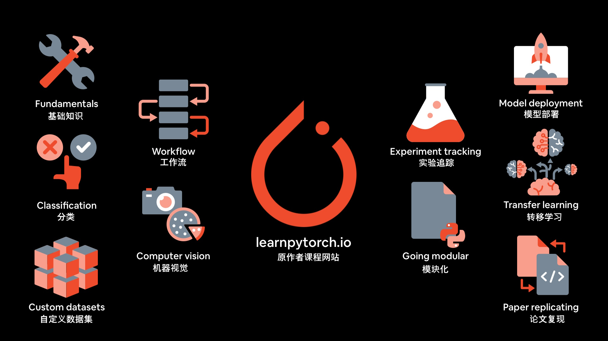

# 使用 PyTorch 进行深度学习

欢迎访问 [零基础到精通：使用PyTorch进行深度学习课程](https://dbourke.link/ZTMPyTorch), 互联网上学习 Pytorch 第二好的地方(第一是 [PyTorch 文档](https://pytorch.org/docs/stable/index.html)).

* **2023年4月更新**： 全新的 [PyTorch 2.0 教程](pytorch_2_intro/) 上线! 由于 Pytorch 2.0 是一个累积（新功能）和向后兼容的版本，因此所有以前的课程材料 *仍然* 可以在 Pytorch 2.0 中使用。

    

## 本页主要内容

* [课程材料/结构](#课程材料/结构)
* [关于本课程](#关于本课程)
* [进度](#进度) (课程创建的进度)
* [日志](#log) (课程创建过程的日志)

## 课程材料/结构 {#课程材料/结构}

* 📖 **在线书籍版本：** 所有材料都可以在可读的在线书中获得 [learnpytorch.io](https://learnpytorch.io)，或者访问 [中文版本](#https://libralibra.github.io/pytorch-deep-learning_CN/)。
* 🎥 **YouTube上的前五个部分：** 通过每天观看视频来学习Pytorch [学习材料的前25小时](https://youtu.be/Z_ikDlimN6A).
* 🔬 **课程重点：** 代码，代码，代码，实验，实验，实验。
* 🏃‍♂️ **教学风格：** [https://sive.rs/kimo](https://sive.rs/kimo).
* 🤔 **提问：** 查看 [Github讨论页面](https://github.com/mrdbourke/pytorch-deep-learning/discussions) 的现有问题/或者提出您的问题。

| **小节**                                                                   | **它涵盖了什么？**                                                                                                                                                                                  | **练习和课外阅读**                                                    | **幻灯片**                                                           |
| -------------------------------------------------------------------------- | --------------------------------------------------------------------------------------------------------------------------------------------------------------------------------------------------- | --------------------------------------------------------------------- | -------------------------------------------------------------------- |
| [00 - Pytorch 基础](00_pytorch_fundamentals.ipynb)                         | 许多用于深度学习和神经网络的基本pytorch操作。                                                                                                                                                       | [访问习题与课外阅读](00_pytorch_fundamentals.ipynb/#exercises)        | [查看幻灯片](./slides/00_pytorch_and_deep_learning_fundamentals.pdf) |
| [01 - PyTorch 工作流](01_pytorch_workflow/)                                | 提供了解决深度学习问题并使用Pytorch建立神经网络的大纲。                                                                                                                                             | [访问习题与课外阅读](01_pytorch_workflow.ipynb/#exercises)            | [查看幻灯片](./slides/01_pytorch_workflow.pdf)                       |
| [02 - PyTorch 神经网络分类](02_pytorch_classification.ipynb/)              | 使用 [01 - PyTorch 工作流](01_pytorch_workflow/) 进行神经网络分类问题。                                                                                                                             | [访问习题与课外阅读](02_pytorch_classification.ipynb/#exercises)      | [查看幻灯片](./slides/02_pytorch_classification.pdf)                 |
| [03 - PyTorch 计算机视觉](03_pytorch_computer_vision.ipynb/)               | 让我们看看如何使用01和02的相同工作流程将Pytorch用于计算机视觉问题。                                                                                                                                 | [访问习题与课外阅读](03_pytorch_computer_vision.ipynb/#exercises)     | [查看幻灯片](./slides/03_pytorch_computer_vision.pdf)                |
| [04 - PyTorch 自定义数据集](04_pytorch_custom_datasets.ipynb/)             | 如何将自定义数据集加载到Pytorch中？另外，我们将在笔记本中为我们的模块化代码（05小节）奠定基础。                                                                                                     | [访问习题与课外阅读](04_pytorch_custom_datasets.ipynb/#exercises)     | [查看幻灯片](./slides/04_pytorch_custom_datasets.pdf)                |
| [05 - PyTorch 模块化](05_pytorch_going_modular.md/)                        | Pytorch为模块化设计，让我们将创建的内容转换为一系列Python脚本（这就是您经常能找到的 Pytorch代码的组织方式）。                                                                                       | [访问习题与课外阅读](05_pytorch_going_modular.md/#exercises)          | [查看幻灯片](./slides/05_pytorch_going_modular.pdf)                  |
| [06 - PyTorch 转移学习](06_pytorch_transfer_learning.ipynb/)               | 让我们选择一个表现出色的预训练模型并通过调整来解决我们自己的问题。                                                                                                                                  | [访问习题与课外阅读](06_pytorch_transfer_learning.ipynb/#exercises)   | [查看幻灯片](./slides/06_pytorch_transfer_learning.pdf)              |
| [07 - 里程碑项目1：Pytorch实验跟踪](07_pytorch_experiment_tracking.ipynb/) | 我们已经建立了一堆模型...跟踪它们的进展不是很好吗？                                                                                                                                                 | [访问习题与课外阅读](07_pytorch_experiment_tracking.ipynb/#exercises) | [查看幻灯片](./slides/07_pytorch_experiment_tracking.pdf)            |
| [08 - 里程碑项目2：Pytorch论文复制](08_pytorch_paper_replicating.ipynb/)   | Pytorch是用于机器学习研究的最流行的深度学习框架，让我们通过复制机器学习论文来了解原因。                                                                                                             | [访问习题与课外阅读](08_pytorch_paper_replicating.ipynb/#exercises)   | [查看幻灯片](./slides/08_pytorch_paper_replicating.pdf)              |
| [09 - 里程碑项目3：模型部署](09_pytorch_model_deployment.ipynb/)           | 我们已经建立了一个工作的pytorch模型...我们如何将其送至他人手中？提示：将其部署到Internet。                                                                                                          | [访问习题与课外阅读](09_pytorch_model_deployment.ipynb/#exercises)    | [查看幻灯片](./slides/09_pytorch_model_deployment.pdf)               |
| [PyTorch 额外的资源](pytorch_extra_resources/)                             | 本课程涵盖了大量的Pytorch和深度学习，但是机器学习的领域很广泛，在这里您会找到推荐的书籍和资源：Pytorch and Deep Learning，ML Engineering，NLP（自然语言处理），时间序列数据，在哪里找到数据集等等。 | -                                                                     | -                                                                    |
| [PyTorch 备忘录](pytorch_cheatsheet/)                                      | 非常快速的浏览Pytorch的一些主要功能以及指向各种资源的链接，在课程中和Pytorch文档中可以找到更多资源。                                                                                                | -                                                                     | -                                                                    |
| [简明 Pytorch 2.0 教程](pytorch_2_intro/)                                  | 一个超简介的 Pytorch 2.0 的简介，有什么是新特性以及如何使用资开始学习的更多信息。                                                                                                                   | -                                                                     | -                                                                    |

## 进展 {#进展}

所有材料完成，并发布在 Zero to Mastery!

请参阅项目页面以获取进行中的工作的公告 - https://github.com/users/mrdbourke/projects/1 

* **总体视频计数：** 321
* **完成代码：** 00, 01, 02, 03, 04, 05, 06, 07, 08, 09
* **完成注释（文本）：** 00, 01, 02, 03, 04, 05, 06, 07, 08, 09
* **完成图像：** 00, 01, 02, 03, 04, 05, 06, 07, 08, 09
* **完成关键提示：** 00, 01, 02, 03, 04, 05, 06, 07, 08, 09
* **完成练习和答案：** 00, 01, 02, 03, 04, 05, 06, 07, 08, 09

查看 [日志](https://github.com/mrdbourke/pytorch-deep-learning#log) 获取每天都有的更新。

## 关于本课程 {#关于本课程}

### 这门课程适合谁？

**您：** 是机器学习或深度学习领域的初学者，想学习Pytorch。

**本课程：** 教您以动手为代码优先的方式教您和许多机器学习概念。

如果您已经在机器学习方面拥有1年+经验，那么本课程可能会有所帮助，但此课程专门设计为对初学者友好。

### 有什么先决条件？

1. 3-6个月 Python 经验。
2.至少一个初学者的机器学习课程（但是，这可能可以跳过，资源会通过许多不同的主题链接在一起）。
3.使用Jupyter笔记本或Google Colab的经验（尽管您可以在课程中逐渐学习）。
4.学习的意愿（最重要）。

对于1和2，我推荐 [零基础到精通：数据科学和机器学习训练营](https://dbourke.link/ZTMMLcourse), 它将教您机器学习和Python的基础知识（可能会有偏爱，因为那也是我的课程）。

### 课程如何进行？

所有课程材料均可通过在线书籍免费获得 [learnpytorch.io](https://learnpytorch.io). 如果您想阅读，我建议您浏览其中的资源。

如果您希望通过视频学习，那么该课程也会以学徒风格的格式教授，这意味着：*我写 Pytorch代码，您写Pytorch代码*。

课程座右铭包含如下表述是有原因的： *如有疑问，请运行代码* and *实验，实验，实验！*.

我的整个目标是帮助您做一件事情：通过编写Pytorch代码来学习机器学习。

代码全部通过 [Google Colab Notebooks](https://colab.research.google.com) (您也可以使用Jupyter笔记本), 令人难以置信的免费资源，可以尝试机器学习。

### 如果我完成课程，我会得到什么？

如果您浏览完视频，则有证书和爵士乐。

但是证书是嗯。

您可以考虑本课程的机器学习方向的构建器。

最后，您将编写数百行Pytorch代码。

并将了解机器学习中许多最重要的概念。

因此，当您构建自己的机器学习项目或检查使用Pytorch的公共机器学习项目时，会感到熟悉，如果不熟悉，至少您会知道从哪里看。

### 我将在课程中建造什么？

我们从Pytorch和机器学习的准基础开始，因此，即使您不熟悉机器学习，您也会跟上进度。

然后我们将探索更高级的领域，包括 PyTorch 神经网络分类、PyTorch 工作流、计算机视觉、自定义数据集、实验跟踪、模型部署，以及我个人最喜欢的：迁移学习，这是一种利用机器学习模型的强大技术 - 将另一个问题中训练的模型应用到您自己的问题中！

在此过程中，您将围绕一个名为 FoodVision 的项目构建三个里程碑项目，FoodVision 是一个用于对食物图像进行分类的神经网络计算机视觉模型。

这些里程碑项目将帮助您练习使用 PyTorch 来涵盖重要的机器学习概念，并创建一个可以向雇主展示的作品集。

### 我如何开始？

您可以在任何设备上阅读材料，但是最好在桌面浏览器中查看和编写代码。

该课程使用称为Google Colab的免费工具。如果您没有经验，我建议学习免费的[Google Colab教程简介](https://colab.research.google.com/notebooks/basic_features_overview.ipynb) 然后回到这里。

开始：

1.单击上面的笔记本或部分链接之一，例如“ [00. pytorch基本原理](00_pytorch_fundamentals.ipynb/)”。
2.单击顶部的“打开Colab”按钮。
3.按 <kbd>Shift+Enter</kbd> 几次，看看会发生什么。

### 我的问题没有回答

可新开一个 [讨论](https://github.com/mrdbourke/pytorch-deep-learning/discussions) 或直接给我发送电子邮件：Daniel（at）Mrdbourke（DOT）com。

## 日志 {#日志}

几乎每天都会更新发生的事情。

* 2023年5月15日-Pytorch 2.0教程完成 +添加到ZTM/Udemy的视频，请参阅代码：https：//www.learnpytorch.io/pytorch_2_intro/
* 2023年4月13日 - 更新Pytorch 2.0笔记本
* 2023年3月30日 - 更新Pytorch 2.0笔记本，并提供更多信息/清洁代码
* 2023年3月23日 - 带注释和图像的升级Pytorch 2.0教程
* 2023年3月13日 - 添加Pytorch 2.0教程的入门代码
* 2022年11月18日 - 在Pytorch中添加3个最常见错误的参考 +链接到课程部分的更多信息：https：//www.learnpytorch.io/pytorch_most_most_common_errors/
* 2022年11月9日 - 添加pytorch作弊表，以非常快速概述Pytorch +链接到课程部分的主要功能：https：//www.learnpytorch.io/pytorch_cheatsheet/
* 2022年11月9日 - 完整的课程材料（300多个视频）现已在Udemy上使用！您可以在此处注册：https：//www.udemy.com/course/pytorch-for-deep-learning/?couponcode=ztmgoodies7（启动交易代码从此行有效期为3-4天）
* 2022年11月4日 - 添加pytorch备忘录的笔记本在`extras/`（对Pytorch的许多最重要功能的简单概述）
* 2022年10月2日 - 第08节和09节的所有视频（最后两个部分的100多个视频）！
* 2022年8月30日 - 录制了15个视频，用于09，总视频：321，完成的第09节视频！！！...甚至大于08！
* 2022年8月29日 - 录制了16个视频09，总视频：306
* 2022年8月28日 - 录制了11个09的视频，总视频：290
* 2022年8月27日 - 录制了16个视频09，总视频：279
* 2022年8月26日 - 在笔记本09中添加完成触摸，为09添加幻灯片，为09创建解决方案和练习
* 2022年8月25日 - 添加注释和清理09，删除TK，清理图像，为09制作幻灯片
* 2022年8月24日 - 将注释添加到09，主要外卖，练习和外交活动
* 2022年8月23日 - 将注释添加到09，添加大量图像/幻灯片
* 2022年8月22日 - 将注释添加到09，开始在幻灯片/图像上工作
* 2022年8月20日 - 将注释添加到09
* 2022年8月19日 - 将注释添加到09，请查看令人敬畏的演示！
* 2022年8月18日 - 将注释添加到09
* 2022年8月17日 - 将注释添加到09
* 2022年8月16日 - 将注释添加到09
* 2022年8月15日 - 将注释添加到09
* 2022年8月13日 - 将注释添加到09
* 2022年8月12日 - 将笔记本09的演示文件添加到`demos/`，开始注释笔记本09，使用解释器文本
* 2022年8月11日 - 笔记本09的骨架代码，课程完成2倍型号，一种用于Foodvision Mini，一个用于（秘密）
* 2022年8月10日 - 为Pytorch添加额外资源的添加部分（有关Pytorch/深度学习的更多信息）：https：//www.learnpytorch.io/pytorch_extra_resources/
* 2022年8月9日 - 在笔记本上添加更多骨架代码09
* 2022年8月8日 - 创建09年的草稿笔记本，最终部署食品视频迷你型号并使其公开访问
* 2022年8月5日 - 录制了11个08的视频，总视频：263，第08节的视频完成！...到目前为止最大的部分
* 2022年8月4日 - 录制了13个视频08，总视频：252
* 2022年8月3日 - 录制了3个08的视频，总视频：239
* 2022年8月2日 - 录制了12个视频08，总视频：236
* 2022年7月30日 - 录制了11个08的视频，总视频：224
* 2022年7月29日 - 添加练习 + 08的解决方案，请参见YouTube上的实时演练：https：//youtu.be/tjpw_by8y3g
* 2022年7月28日 - 添加幻灯片08
* 2022年7月27日 - 清理08的大部分，从08的幻灯片开始
* 2022年7月26日 - 添加08的注释和图像
* 2022年7月25日 - 添加08的注释
* 2022年7月24日 -  YouTube上的单个视频（25小时！！！）在单个视频中发布（笔记本00-04）：https：//youtu.be/Z_IKDLIMN6A
* 2022年7月21日 - 添加08的注释和图像
* 2022年7月20日 - 添加08的注释和图像，变得如此接近！这是一个史诗般的部分
* 2022年7月19日 - 添加注释和图像08
* 2022年7月15日 - 添加08的注释和图像
* 2022年7月14日 - 添加08的注释
* 2022年7月12日 - 添加08的注释，Woo Woo这是BigGgg部分！
* 2022年7月11日 - 添加08的注释
* 2022年7月9日 - 添加08的注释
* 2022年7月8日 - 将一堆注释添加到08
* 2022年7月6日 - 在ZTM学院启动了课程，其中包括00-07节的视频！🚀 -https：//dbourke.link/ztmpytorch
* 2022年7月1日 - 添加08的注释和图像
* 2022年6月30日 - 添加08的注释
* 2022年6月28日 - 录制了11个第07节的视频，总数213，所有第07节的视频完成！
* 2022年6月27日 - 录制了11个第07节的视频，总计视频计数202
* 2022年6月25日 - 重新创建了第06节的7个视频，包括更新的API，总视频计数191
* 2022年6月24日 - 为第06节重新创建了12个视频，以包括更新的API
* 2022年6月23日 - 完成07的注释，添加YouTube上07 +视频演练的练习模板和解决方案：https：//youtu.be/co_r2fycaju
* 2022年6月21日 - 使08可运行的端到端，添加图像和注释07
* 2022年6月17日 - 修复06，07 V2用于即将进行的Torchvision版本升级，添加大量注释到08
* 2022年6月13日 - 添加笔记本08首版，开始复制视觉变压器纸
* 2022年6月10日 - 添加07 V2的注释
* 2022年6月9日 - 为`torchvision` v0.13创建07 V2（当释放`torchvision = 0.13`时将替换07 V1）
* 2022年6月8日-Adapt 06 V2用于`torchvision` v0.13（释放`torchvision = 0.13`时将替换06 V1）
* 2022年6月7日 - 创建笔记本06 V2，用于即将到来的`torchvision` v0.13更新（新的传输学习方法）
* 2022年6月4日 - 添加07的注释
* 2022年6月3日 - 添加到07的注释数量
* 2022年5月31日 - 为07添加一堆注释，使代码可运行的端到端运行
* 2022年5月30日 - 记录4个06的视频，完成的第06节，第07节，总数186
* 2022年5月28日 - 记录10个06的视频，总视频182
* 2022年5月24日 - 添加06的解决方案和练习
* 2022年5月23日 - 完成的注释和图像06，进行练习和解决方案的时间
* 2202年5月22日 - 向06添加大量图像
* 2022年5月18日 - 向06添加大量注释
* 2022年5月17日 - 为第06节添加了一堆注释
* 2022年5月16日 - 录制了10个第05节的视频，完成第05节的视频
* 2022年5月12日 - 添加了05的练习和解决方案
* 2022年5月11日 - 清理第1部分和第2部分笔记本，用于05，为05制作幻灯片，开始练习和解决方案05
* 2022年5月10日- 海量更新到05部分，请参见网站，看起来很漂亮：https：//www.learnpytorch.io/05_pytorch_ogentor/
* 2022年5月9日 - 添加一堆材料05，清理文档
* 2022年5月8日 - 为05添加一堆材料
* 2022年5月6日 - 继续制作05的材料
* 2022年5月5日 - 更新第05节带标题/轮廓
* 2022年4月28日 - 录制了13个04的视频，04的完成视频，现在为05制作材料
* 2022年4月27日 - 录制了3个视频04
* 2022年4月26日 - 录制了10个04的视频
* 2022年4月25日 - 录制了11个视频04
* 2022年4月24日 -  04的准备幻灯片
* 2022年4月23日 - 录制了6个03的视频，03的完成视频，现在为04
* 2022年4月22日 - 录制了5个视频03
* 2022年4月21日 - 录制了9个03的视频
* 2022年4月20日 - 录制了3个视频03
* 2022年4月19日 - 录制了11个视频03
* 2022年4月18日 -  04的完成练习/解决方案，在YouTube上添加了04个练习/解决方案的实时编码演练：https：//youtu.be/vsfmfmf9wqwx0
* 2022年4月16日 -  03的完成练习/解决方案，在YouTube上添加了03个练习/解决方案的实时编码演练：https：//youtu.be/_pibmqpeyha
* 2022年4月14日 - 添加04的最终图像/注释，开始练习/解决方案03＆04
* 2022年4月13日 - 添加更多图像/注释04
* 2022年4月3日 - 添加更多注释04
* 2022年4月2日 - 添加更多注释04
* 2022年4月1日 - 添加更多注释04
* 2022年3月31日 - 为04添加更多注释
* 2022年3月29日 - 添加更多注释04
* 2022年3月27日 - 开始添加04的注释
* 2022年3月26日 - 为04制作数据集
* 2022年3月25日 - 为03制作幻灯片
* 2022年3月24日 - 修复错误03在文档中不起作用（最后）
* 2022年3月23日 - 添加更多图像03
* 2022年3月22日 - 添加03的图像
* 2022年3月20日 - 添加更多注释03
* 2022年3月18日 - 添加更多注释03
* 2022年3月17日 - 添加更多注释03
* 2022年3月16日 - 添加更多注释03
* 2022年3月15日 - 添加更多注释03
* 2022年3月14日 - 开始为笔记本03添加注释，请参阅此处的工作：https：//www.learnpytorch.io/03_pytorch_computer_vision/
* 2022年3月12日 - 录制了12个视频，用于02，第02节，现在为03、04、05录制了材料
* 2022年3月11日 - 录制了9个02的视频
* 2022年3月10日 - 录制了10个02的视频
* 2022年3月9日 - 清理02的幻灯片/代码，准备录制
* 2022年3月8日 - 录制了9个第01节的视频，完成了01节，现在为02
* 2022年3月7日 - 录制的4个视频，第01节
* 2022年3月6日 - 录制的4个视频，第01节
* 2022年3月4日 - 录制了10个第0节的视频
* 2022年2月20日 - 录制了00节的8个视频，完成的部分，现在为01
* 2022年2月18日 - 录制了00节的13个视频
* 2022年2月17日 - 录制了00节的11个视频
* 2022年2月16日 - 添加的设置指南
* 2022年2月12日 - 用表格的材料，完成图像和幻灯片01
* 2022年2月10日 -  00的完成幻灯片和图像，笔记本已准备就绪：https：//www.learnpytorch.io/00_pytorch_fundamentals/
* 2022年2月1日 -  07年1月1日 - 添加02的注释，完成，仍然需要图像，立即开始练习/解决方案
* 2022年1月31日 - 开始添加02的注释
* 2022年1月28日 - 添加01的练习和解决方案
* 2022年1月26日 - 更多的注释到01，明天应该完成，将进行练习 +解决方案。
* 2022年1月24日 - 向01添加一堆注释
* 2022年1月21日 - 开始添加01的注释
* 2022年1月20日 - 完成00的注释（仍然需要添加图像），添加练习和00的解决方案
* 2022年1月19日 - 为00添加更多注释
* 2022年1月18日 - 添加更多注释00
* 2022年1月17日 - 从假期回来，向00增加了更多注释
* 2021年12月10日 - 开始添加00
* 2021年12月9日 - 为课程创建了一个网站（[learnpytorch.io]（https：//learnpytorch.io））您会看到随着开发的继续而发布的更新
* 2021年12月8日 - 清理笔记本07，开始返回代码并添加注释
* 2021年11月26日 - 添加了四个不同的实验，需要清理并使得更直接
* 2021年11月25日 -  06的清洁代码，为07添加骨架代码（实验跟踪）
* 2021年11月24日 - 更新04，05，06笔记本电脑，更轻松的消化和学习，每个部分应涵盖3个大创意，现在05专用于将笔记本电脑代码转换为模块化代码
* 2021年11月22日 - 更新04火车和测试功能，以使更直接
* 2021年11月19日 - 添加05（转移学习）笔记本，更新04中的自定义数据加载代码
* 2021年11月18日 -  03的更新视觉代码，并在04中添加了自定义数据集加载代码
* 2021年11月12日 - 为自定义数据集加载的笔记本04添加了一堆骨架代码，接下来是使用自定义数据建模
* 2021年11月10日 - 研究04的自定义数据集的最佳实践
* 2021年11月9日 - 更新03骨架代码要完成构建CNN型号的构建，上限为04，用于加载自定义数据集
* 2021年11月4日 - 将GPU代码添加到03 +火车/测试循环 +`helper_functions.py`
* 2021年11月3日 - 添加03的基本启动，将在周末结束之前完成
* 2021年10月29日 - 整理02的骨架代码，还有一些要清洁/整理的东西，创建03
* 2021年10月28日 -  02年完成的骨骼代码，明天清洁/整理，下周03
* 2021年10月27日 - 为02添加一堆代码，明天/到周末结束
* 2021年10月26日 - 更新00，01，02带有轮廓/代码，00＆01完成的骨架代码，02 NEXT
* 2021年10月24日23日 - 更新00和01笔记本，带有更多大纲/代码
* 2021年10月20日 - 添加01和02的V0大纲，当然为readme添加粗略的轮廓，本课程将重点放在更少但更好的
* 2021年10月19日 - 启动仓库🔥，添加基本原理笔记本v0
